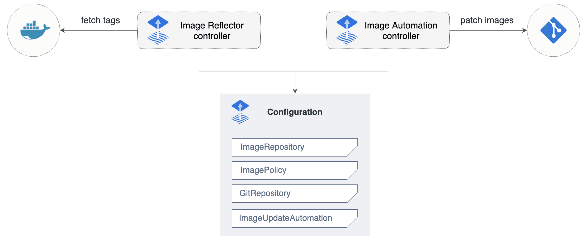

#  Flux2
Flux2使用Kubernetes的API扩展系统并与Prometheus和Kubernetes生态系统的其他核心组件集成，脱胎于GitOps工具包，是针对Kubernets的持续交付和渐进式交付的解决方案。
换句话讲，Flux 是一种用于保持 Kubernetes 集群与配置源（如 Git 仓库和 OCI 工件）同步，并在有新代码要部署时自动更新配置的工具。
Flux是云原生基金会CNCF的毕业项目，被众多组织和云提供商广泛应用于生产环境。


## FLux2的组件
- Source Controller
  源控制器的主要作用是为制品获取获取提供一个通用接口。源控制器的API定义了一组Kubernetes对象，集群管理员可与之交互，将Git和Helm等资源加载到专用的控制器。
  
  - GitRepository CRD
  - OCIRepository CRD
  - HelmRepository CRD
  - HelmChart CRD
  - Bucket CRD
- Kustomize Controller
  
  kustomize-controller是Kubernetes的一种operator，是一种使用Kubernetes manifest定义并用Kustomize组装的基础设施和工作负载运行持续交付的通道
  - Kustomization CRD
- Helm Controller
  
  Helm Controller是一个Kubernetes的另一种operator，允许用户使用Kubernetes清单声明式地管理Helm资源的发布
  - HelmRelease CRD
- Notification Controller
  专门用于处理南北向事件
  
  - Provider CRD
  - Alert CRD
  - Receiver CRD
- Image Automation Controllers
  image-reflector-controller和image-automation-controller相互配合，实现在新容器镜像可用时更新Git仓库
  
  - ImageRepository CRD
  - ImagePolicy CRD
  - ImageUpdateAutomation CRD
## 多说无益，来实战
### Flux2实现docker镜像更新至仓库后自动部署到Kubernetes集群

#### Flux安装
**Prerequisites**
flux2官方文档中标明要安装flux用户必须要整个kubernetes集群的**Cluster admin**权限，因为在安装过程中会新建一个名为flux-system的Namespace并初始化相关资源，所以权限必须要足够。
对应版本如下：可根据实际情况自行下载或升级

Tips：flux或许可以运行在>1.19版本的集群上，但不保证一定能够按预想执行。

| Kubernetes version | Minimum required |
|--------------------|------------------|
| v1.25	             | \>= 1.25.0       |
| v1.26	             | \>= 1.26.0       |
| v1.27	             | \>= 1.27.0       |
| v1.28 and later	   | \>= 1.28.0       |

#### Flux Cli安装
```shell
# linux/mac
curl -s https://fluxcd.io/install.sh | sudo bash
# 配置命令自动补全
. <(flux completion bash)
# 查看CLI版本
flux --version
# 检查kubernetes集群版本是否支持
flux check --pre
```

#### 安装Flux
以下三种方式三选一即可
```shell
# flux cli（推荐使用，指明kubeconfig连接哪个kubernetes集群，默认为当前context的集群）
flux install --components-extra="image-reflector-controller,image-automation-controller" --kubeconfig=<KUBECFG_PATH>
# kubectl
kubectl apply -f https://github.com/fluxcd/flux2/releases/latest/download/install.yaml
# helm
helm install -n flux-system flux oci://ghcr.io/fluxcd-community/charts/flux2
```
#### 使用SSH方式初始化Flux（比较通用）
- 创建git仓库（众所周知，flux脱胎于Gitops tools，所以我们需要一个git仓库来作为CICD流水线的存储库），这里以github为例，仓库名字就叫flux-kubecit-service，仓库随便叫什么名字都行。
  那么可能有人会问，我不会科学上网，只能访问gitee或者说因为公司内网环境受限，只能访问公司内容的gitlab怎么办？
  不要怕，仍然是创建仓库，仓库在哪里不关键，只要能连得上就行。
```shell
flux bootstrap git \
  --url=ssh://git@github.com/lbzss/flux-kubecit-service.git \
  --branch=master \
  --private-key-file=/home/go/.ssh/id_rsa \
  --path=clusters/kubecit-service \
  --components-extra=image-reflector-controller,image-automation-controller
```
Tips： url必须按照上面的格式来写，否则会报错。branch不关键。private-key-file是你用户的私钥，因为flux会使用机器人调用api往之前创建的git仓库里上传版本变更记录，所以它一定需要私钥，而且这个私钥必须是已经上传过github或git仓库的用户所有，证明这个用户拥有这个仓库的所有权或管理员权限。
path也很重要，建议第一次以clusters作为base path，后面跟你的项目名称。components-extra是指需要安装image-reflector-controller和image-automation-controller组件，flux安装的时候默认不会有这两个组件。

初始化成功后就可以去git仓库里看看文件结构了

可以看到有个没见过的用户已经在仓库中创建了对应的目录并且生成了配置文件。
那恭喜你，第一步已经完成了。

#### 利用flux对项目进行配置
- 下载仓库
git clone git@github.com:lbzss/flux-kubecit-service.git
此时服务器上仓库路径下文件层级如下图


- 部署服务
```shell
# 生成需要的manifest，这里我们用deployment来管理pod
cat <<EOF > ./clusters/kubecit-service/kubecit-service-deployment.yaml
apiVersion: apps/v1
kind: Deployment
metadata:
  name: kubecit-service
  namespace: wlb965
spec:
  selector:
    matchLabels:
      app: kubecit-service
  replicas: 1
  template:
    metadata:
      labels:
        app: kubecit-service
    spec:
      containers:
        - name: kubecit-service
          image: z627062293/kubecit-service:v0.0.1
          imagePullPolicy: IfNotPresent
          ports:
            - name: http
              containerPort: 8000
              protocol: TCP
EOF
# 将更改推送到git仓库
git add -A && \
git commit -m "add kubecit-service deployment" && \
git push origin master
# 手动触发执行
flux reconcile kustomization flux-system --with-source
```
这个时候可以去集群上验证一下pod和deployment是否已经创建成功。


- 配置镜像扫描
```shell
flux create image repository kubecit-service \
--image=z627062293/kubecit-service \
--interval=5m \
--export > ./clusters/kubecit-service/kubecit-service-registry.yaml

git add -A && \
git commit -m "add kubecit-service image scan" && \
git push origin master

flux reconcile kustomization flux-system --with-source
```
再执行命令看下镜像扫描状态
```shell
# 检查状态
flux get image repository kubecit-service
kubectl -n flux-system describe imagerepositories kubecit-service
```
此时，我们的dockerhub中只有v0.0.1和v0.0.2两个版本的镜像，扫描结果与dockerhub仓库中一致。
- 创建镜像策略
```shell
flux create image policy kubecit-service \
  --image-ref=kubecit-service \
  --select-semver=">=1.0.0" \
  --export >./clusters/kubecit-service/kubecit-service-policy.yaml

cat ./clusters/kubecit-service/kubecit-service-policy.yaml
---
apiVersion: image.toolkit.fluxcd.io/v1beta2
kind: ImagePolicy
metadata:
name: kubecit-service
namespace: flux-system
spec:
imageRepositoryRef:
name: kubecit-service
policy:
semver:
range: '>=1.0.0'

# 将更改推送到git仓库
git add -A && \
git commit -m "add kubecit-service deployment" && \
git push origin master

# 手动触发执行
flux reconcile kustomization flux-system --with-source
```
查看镜像扫描结果，因为镜像仓库中确实没有tag为>1.0.0的镜像，所以会扫描Not Ready
```shell
flux get image policy kubecit-service
NAME            LATEST IMAGE    READY   MESSAGE                                               
kubecit-service                 False   unable to determine latest version from provided list
```
接下来再往dockerhub中推送一个tag为1.0.1的镜像。并且等待镜像扫描结果更新。

- 修改deployment manifest，后面加上注释，表示镜像策略使用flux-system中创建的kubecti-service
```shell
# 修改spec.template.spec.containers.image镜像
image: z627062293/kubecit-service:v1.0.0 #{"$imagepolicy": "flux-system:kubecit-service"}
```

- 创建ImageUpdateAutomation资源
```shell
flux create image update flux-system \
--interval=1m \
--git-repo-ref=flux-system \
--git-repo-path="./clusters/kubecit-service" \
--checkout-branch=master \
--push-branch=master \
--author-name=fluxcdbot \
--author-email=fluxcdbot@users.noreply.github.com \
--commit-template="{{range .Updated.Images}}{{println .}}{{end}}" \
--export > ./clusters/kubecit-service/flux-system-automation.yaml

# 将更改推送到git仓库
git add -A && \
git commit -m "add kubecit-service deployment" && \
git push origin master

# 手动触发执行
flux reconcile kustomization flux-system --with-source

# 运行命令查看deployment中的镜像tag是否更新
kubectl get deployment/kubecit-service -oyaml | grep 'image:'
```
- 验证
再次推送个tag为1.0.2的镜像到dockerhub，看看kubernetes中的deployment是否会被更新。
经过漫长的等待，发现集群中的应用镜像版本已被更新到v1.0.2，符合预期

### 小结
至此，使用Flux2实现docker镜像更新至仓库后自动部署到Kubernetes集群的cd流程已经实现。

仓库链接：
https://github.com/lbzss/flux-kubecit-service  

参考文档：
https://fluxcd.io/flux/guides/image-update/
